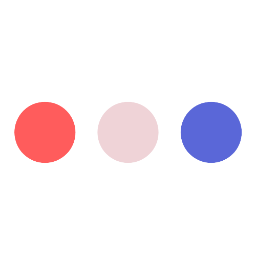

<!-- INTROS -->

  

  <h3 align="center">My Data Science Projects</h3>

<!-- TABLE OF CONTENTS -->

  
Table of Contents

  <ol>
    <li>
      <a href="#about-the-project">About The Project</a>
    </li>
    <li>
      <a href="#my-works">My Works</a>
      <ul>
        <li><a href="#space-x-falcon-9-launching">Space X Falcon 9 Launching</a></li>
        <li><a href="#neural-translation-model-using-rnn">Neural Translation Model Using RNN</a></li>
        <li><a href="#fashionmnist-classification-using-cnn">FashionMNIST Classification Using CNN</a></li>
        <li><a href="#image-classifier-for-the-svhn-using-mlp-and-cnn">Image Classifier for the SVHN Using MLP and CNN</a></li>
        <li><a href="#transfer-deep-learning-using-resnet-for-image-classification">Transfer Deep Learning Using ResNet for Image Classification</a></li>
      </ul>
    </li>
  </ol>

<!-- ABOUT THE PROJECT -->
## About The Project
This is the project to show my works in the data science field including some machine learning, deep learning models and data analysis notebooks.
<!-- MY WORKS -->
## My Works
### Space X Falcon 9 Launching
[Space X Falcon 9 Launching Project](/Space_X_Falcon_9_Launching_Prediction) 

In this project, I will predict if the Falcon 9 first stage will land successfully. SpaceX advertises Falcon 9 rocket launches on its website with a cost of 62 million dollars; other providers cost upward of 165 million dollars each, much of the savings is because SpaceX can reuse the first stage. Therefore if we can determine if the first stage will land, I can determine the cost of a launch. This information can be used if an alternate company wants to bid against SpaceX for a rocket launch.
### Neural Translation Model Using RNN
[Neural Translation Model Using RNN Project](/Neural_Translation_Model_Using_RNN) 

For the project, I will use a language dataset from http://www.manythings.org/anki/ to build a neural translation model. This dataset consists of over 200,000 pairs of sentences in English and German. In order to make the training quicker, I will restrict to the dataset to 20,000 pairs. 

The goal is to develop a neural translation model from English to German, making use of a pre-trained English word embedding module.
### FashionMNIST Classification Using CNN
[FashionMNIST Classification Using CNN Project](/FashionMNIST_Classification_Using_CNN) 

In this project, I will classify Fashion-MNIST dataset using convolutional neural networks. 
The goal is to develope a CNN model to classify FashionMNIST objects.
### Image Classifier for the SVHN Using MLP and CNN
[Image Classifier for the SVHN Using MLP and CNN Project](/Image_Classifier_For_The_SVHN_Using_MLP_And_CNN) 

For this project, I will use the SVHN dataset. This is an image dataset of over 600,000 digit images in all, and is a harder dataset than MNIST as the numbers appear in the context of natural scene images. SVHN is obtained from house numbers in Google Street View images.

Y. Netzer, T. Wang, A. Coates, A. Bissacco, B. Wu and A. Y. Ng. "Reading Digits in Natural Images with Unsupervised Feature Learning". NIPS Workshop on Deep Learning and Unsupervised Feature Learning, 2011.
My goal is to develop an end-to-end workflow for building, training, validating, evaluating and saving a neural network that classifies a real-world image into one of ten classes.
### Transfer Deep Learning Using ResNet for Image Classification
[Transfer Deep Learning Using ResNet for Image Classification Project](/Transfer_Deep_Learning_Using_ResNet_for_Image_Classification) 

In this notebook, I will use pre-trained models to classify between the negative and positive samples; the dataset is already provided. The particular pre-trained model will be resnet18
